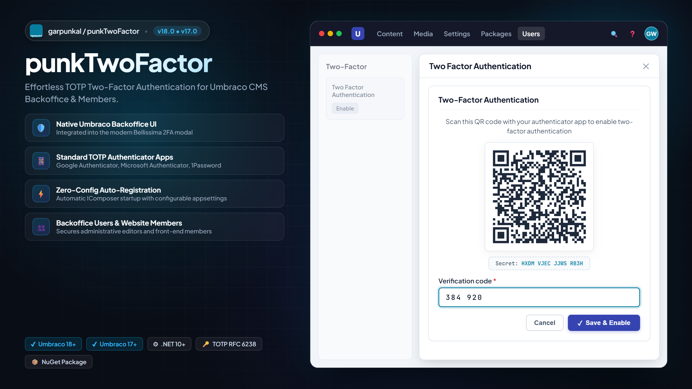

# punkTwoFactor



[](https://www.nuget.org/packages/punkTwoFactor/)

An Umbraco package that sets up Two Factor Authentication (2FA) for Umbraco backoffice users and members using standard TOTP authenticator apps (e.g., Google Authenticator, Microsoft Authenticator, 1Password).

## NuGet

```shell
dotnet add package punkTwoFactor
```

or

```shell
Install-Package punkTwoFactor
```

https://www.nuget.org/packages/punkTwoFactor/

## Configuration

In Umbraco 18+, `punkTwoFactor` automatically registers itself via an Umbraco `IComposer` on startup.

Optionally add the following section to your `appsettings.json` to customize the authenticator issuer name or provider identifier:

```json
"punkTwoFactor": {
  "ProviderName": "Two Factor Authentication",
  "Issuer": "My Umbraco Site"
}
```

- **`Issuer`**: The display name shown inside authenticator apps (e.g. Google Authenticator, Microsoft Authenticator).
- **`ProviderName`**: The technical name used to register the provider (defaults to `"Two Factor Authentication"`).

## Usage in Backoffice

1. Log into the Umbraco backoffice.
2. Click your user avatar in the top-right corner.
3. Click **Configure Two-Factor**.
4. Click **Enable** on Two Factor Authentication.
5. Scan the QR code with your mobile authenticator app and enter the 6-digit verification code.

## Custom Registration (Optional)

If you prefer to configure or register the provider manually in code:

```csharp
using punkTwoFactor.Extensions;

// Configure options from appsettings:
services.ConfigureTwoFactorConfig(builder.Config);

// Or configure via builder:
builder.AddBackOfficeTwoFactorAuthentication();
builder.AddMemberTwoFactorAuthentication();
```

## Compatibility

- Umbraco 18+
- .NET 10+
